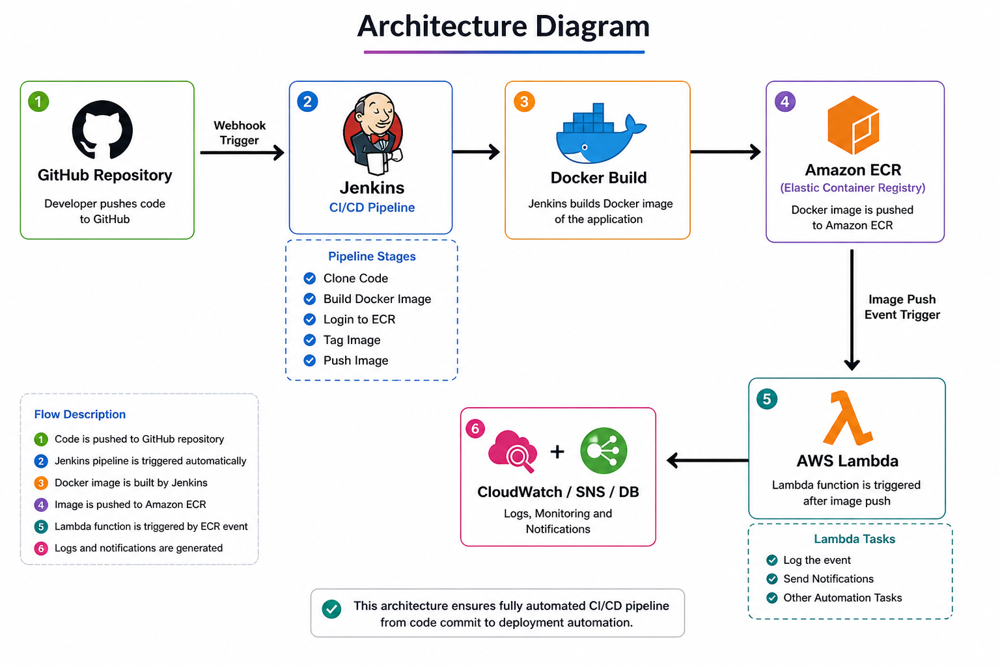
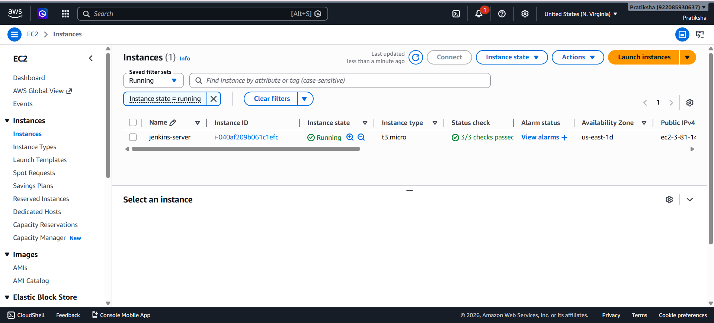
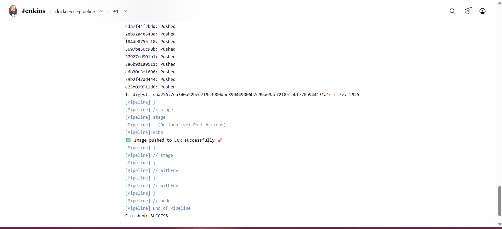
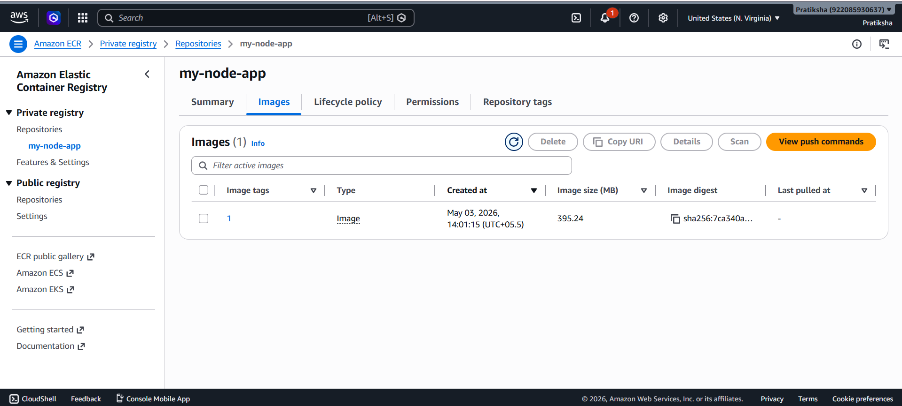
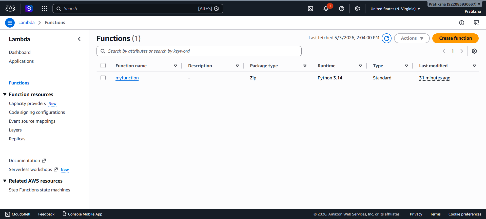
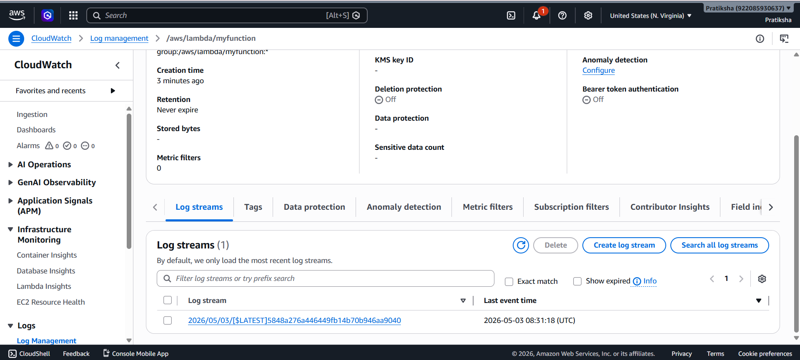

# 🚀 Automated Docker Image Deployment to Amazon ECR with Jenkins & Lambda

## 📌 Project Title

Automated Docker Image Deployment to Amazon ECR with Jenkins and Lambda Integration

---

## 🧠 Scenario

The organization was manually building and pushing Docker images, causing:

* Versioning issues
* Deployment delays

To solve this, a CI/CD pipeline was implemented using Jenkins to:

* Automatically build Docker images
* Push images to Amazon ECR
* Trigger AWS Lambda for post-deployment automation

---

## 🎯 Objective

To design a fully automated CI/CD pipeline that:

1. Builds Docker images on code changes
2. Pushes images to Amazon ECR
3. Triggers AWS Lambda for post-deployment tasks

---

## 🏗️ Architecture Diagram

```
        +----------------+
        |   GitHub Repo  |
        +--------+-------+
                 |
                 v
        +----------------+
        |    Jenkins     |
        |  (CI/CD Tool)  |
        +--------+-------+
                 |
        Build Docker Image
                 |
                 v
        +----------------+
        |   Docker Image |
        +--------+-------+
                 |
        Push to ECR
                 |
                 v
        +-----------------------------+
        |   Amazon ECR (Repository)   |
        +-------------+---------------+
                      |
          Event / Trigger
                      |
                      v
        +-----------------------------+
        |     AWS Lambda Function     |
        +-----------------------------+
                      |
            Logs / Notifications
                      |
                      v
        +-----------------------------+
        |   CloudWatch / SNS / DB     |
        +-----------------------------+
```

---

## 🛠️ Technologies Used

* Jenkins
* Docker
* Amazon ECR
* AWS Lambda
* GitHub
* AWS CLI

---

## ⚙️ Workflow

1. Developer pushes code to GitHub
2. Jenkins pipeline is triggered
3. Jenkins pulls latest code
4. Docker image is built
5. Image is tagged with build number
6. Image is pushed to Amazon ECR
7. Lambda function is triggered
8. Logs/notifications are generated

---

## 📂 Project Structure

```
.
├── Dockerfile
├── app.js
├── package.json
├── Jenkinsfile
└── README.md
```

---

## ⚙️ Complete Setup (All Commands Used)

### 🔹 1. System Setup (Ubuntu EC2)
```bash
sudo apt update
sudo apt install docker.io -y
```
# Java for Jenkins
```bash
sudo apt install openjdk-21-jre-headless -y
```
# Verify
```bash
java --version
docker --version
```
# 🔹 2. Install Jenkins
```bash
sudo wget -O /etc/apt/keyrings/jenkins-keyring.asc https://pkg.jenkins.io/debian-stable/jenkins.io-2026.key

echo "deb [signed-by=/etc/apt/keyrings/jenkins-keyring.asc] https://pkg.jenkins.io/debian-stable binary/" | sudo tee /etc/apt/sources.list.d/jenkins.list > /dev/null

sudo apt update
sudo apt install jenkins -y
```
# 🔹 3. Give Docker Permission
```bash
sudo usermod -aG docker ubuntu
sudo usermod -aG docker jenkins
sudo systemctl restart jenkins
sudo reboot
```
# 🔹 4. Configure AWS CLI
```bash
aws configure
```
```bash
Enter:
Access Key:
Secret Key:
Region: us-east-1
```
# Then for Jenkins user:
```bash
sudo su - jenkins
aws configure
aws sts get-caller-identity
```
# 🔹 5. Docker Commands
```bash
docker build -t my-node-app .
docker run -p 3000:3000 my-node-app
```
# 🔹 6. ECR Login Command (Used in Jenkins)
```bash
aws ecr get-login-password --region us-east-1 \
| docker login --username AWS --password-stdin 922085930637.dkr.ecr.us-east-1.amazonaws.com
```
# 🔹 7. Tag & Push Image
```bash
docker tag my-node-app:latest 922085930637.dkr.ecr.us-east-1.amazonaws.com/my-node-app:latest

docker push 922085930637.dkr.ecr.us-east-1.amazonaws.com/my-node-app:latest
```

---

## ☁️ Amazon ECR Setup

* Created ECR repository
* Authenticated Docker using AWS CLI
* Pushed image manually (initial test)

---

## 🔄 Jenkins Pipeline

Pipeline stages:

* Clone Code
* Build Docker Image
* Login to ECR
* Tag Image
* Push Image

---

## ⚡ AWS Lambda Integration

* Lambda function created (Python/Node.js)
* Triggered after image push
* Used for:

  * Logging
  * Notifications

---

## 📸 Project Implementation Screenshots

### 🏗️ Architecture Diagram
The following diagram illustrates the automated CI/CD workflow from GitHub to AWS Lambda.


---

### 🖥️ Infrastructure: EC2 Instance
The Jenkins server is hosted on an AWS EC2 `t3.micro` instance, currently in a **Running** state.


---

### ⚙️ CI/CD Pipeline Execution
Jenkins Pipeline successfully triggered and executed all stages for the `docker-ecr-pipeline`.


---
---

### 📦 Container Registry: Amazon ECR
The Docker image `my-node-app` has been successfully pushed and stored in the private Amazon ECR repository.


---

### ☁️ Serverless Deployment & Monitoring
Deployment verification through AWS Lambda configuration and CloudWatch Log management.

**AWS Lambda Function:**


**CloudWatch Log Streams:**


---

### ⚡ AWS Lambda Triggered
Lambda function executed after deployment.


  

---

## 🧩 Challenges Faced

* Jenkins AWS credentials issue
* Docker permission issues
* ECR login failure

---

## ✅ Final Outcome

* Fully automated CI/CD pipeline
* Docker image build & push automated
* Lambda triggered successfully

---

## 🚀 Future Enhancements

* Integrate SNS for notifications
* Deploy to ECS
* Use Terraform for infrastructure

---

## 👨‍💻 Author

**Pratiksha Lavand**  
☁️ Aspiring Cloud & DevOps Engineer  
🔗 GitHub: [github.com/your-username](https://github.com/pratikshalavand98/)  
🔗 LinkedIn: [linkedin.com/in/your-linkedin-id](https://www.linkedin.com/in/pratiksha-lavand/)

---

## ⭐ Conclusion

This project demonstrates a complete CI/CD pipeline integrating Docker, Jenkins, AWS ECR, and Lambda for automated deployment workflows.
